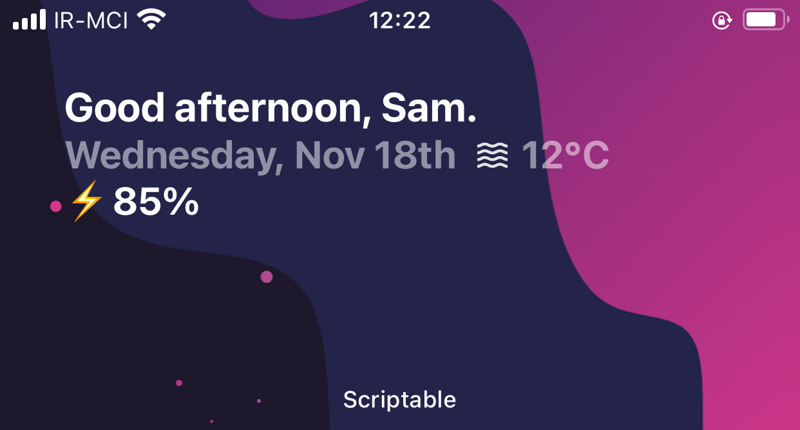

# Home-Intro-Widget-V1

    

First version of Home Intro Widget with a simple battery and localization for any language. Check out screenshot for more info.
Transparent and works in offline as well.

## Guideance: Put your API and City Code from openweathermap.org, also your local/country code.

### Workable widget Size: Large, Medium.

